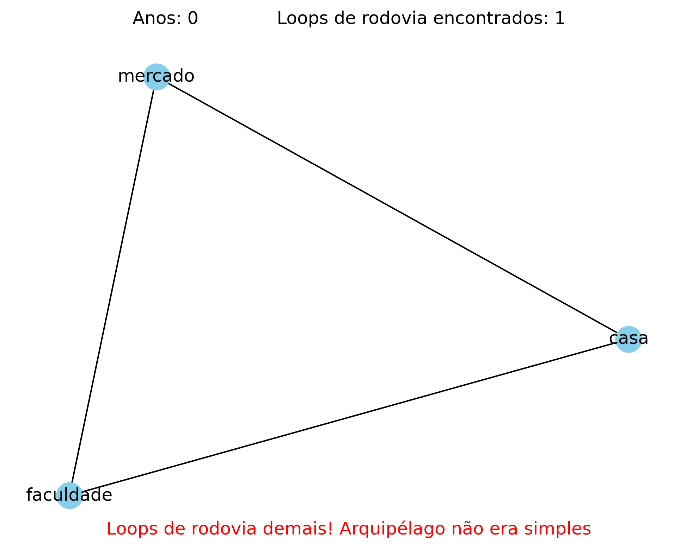

<!-- CABEÇALHO -->
<div align="center">
  
</div>

# Arquipélago e vias

Visualize grafos e verifique se eles têm loops excessivos.

## 📸 Demo

  

## 📦 Instalação

Clone o repositório e instale as dependências:

```bash
git clone https://github.com/yourusername/project-name.git
cd project-name
pip install -r requirements.txt
```

## Temática

Esse projeto baseia-se no tema de um povo fictício que habitava ilhas conectadas por rodovias e hidrovias. Leia o arquivo ```juvias.ipynb``` ou o texto-base do problema em [1] para situar-se melhor.

## 🛠 Uso

Rode o programa:

```bash
python vias.py
```

Ou rode o **jupyter notebook** ```juvias.ipynb```.


## Entrada
- Dois inteiros: Número de coenxões e anos do período análise do arquipélago (N)
- N vezes: vértice 1 e vértice 2 que serão conectados e o tipo de conexão - "r" para rodovia (rompível) e "h" para hidrovia (permanente).

## Saída
- Atualização de um ```.PNG``` para visualizar o grafo correspondente em cada análise
- Após todas as análises, imprime no terminal se o arquipélago era simples ou não.


Exemplo de entrada/saída:

```bash
$ python vias.py
úmero de conexões, anos: 3 0 
USO: <vértice 1> (texto) <vertice 2> (texto) <tipo de via> (r ou h) --- Ex: hospital mercado r
vértice 1, vértice 2, tipo de via: casa faculdade r  
vértice 1, vértice 2, tipo de via: faculdade mercado r
vértice 1, vértice 2, tipo de via: mercado casa h
ENTER para continuar
ENTER para continuar
ENTER para continuar
ENTER para continuar
O arquipélago não era simples!
```
Última visualização gerada:

 


## ✨ Funções

- Detecção de loops excessivos em grafos;
- Distinção entre loops rompíveis e permanentes;
- Configuração de limites de laços rompiveis para parada do programa;
- Visualização das execuções sobre o grafo.

## 🐍 Versão do Python

- Python 3.13.7

## 📄 Licença

GNU General Public License v3.0

Leia o arquivo `LICENSE` para mais detalhes.

## 📖 Referência

1. Insipirado pela questão-problema [Hidrovias e Rodovias](https://olimpiada.ic.unicamp.br/static/extras/obi2025/provas/ProvaOBI2025_f3ps.pdf) de uma prova da Olimpíada Brasileira de Informática.

## Desenvolvedor do Projeto

| [<br><sub>Carlos Gabriel de Oliveira Campos</sub>](https://github.com/cg-oc) |
| :---: |
Aluno do primeiro semestre de Ciência e Tecnologia, na Ilum Escola de Ciência

## 🎓 Professores


> **Prof. Dr. Leandro Nascimento Lemos**
> * **Contato:** `leandro.lemos@ilum.cnpem.br`
---
> **Prof. Dr. Daniel Roberto Cassar**
> * **Contato:** `daniel.cassar@ilum.cnpem.br`
---
> **Prof. Dr. James Moraes de Almeida**
> * **Contato:** ` james.almeida@ilum.cnpem.br`
---

 

<div align="center">
  
</div>